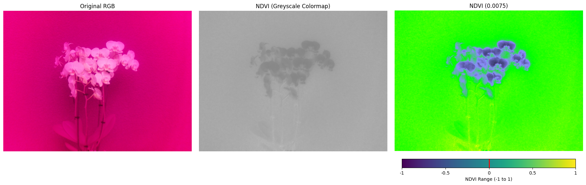

# README

## Project Overview
This project provides a modular framework for capturing and processing images, calculating NDVI (Normalized Difference Vegetation Index), and visualizing results. The workflow includes:

1. Capturing images using a Raspberry Pi camera.
2. Cropping images for specific use cases (e.g., Arducam 5MP).
3. Calculating NDVI values from images.
4. Applying colormaps to NDVI images for better visualization.
5. Segmenting plant regions and analyzing NDVI data.

## Project Structure

```
project/
├── images/                     # Directory for storing captured and processed images
├── modules/                    # Directory containing modular Python scripts
│   ├── camera_capture.py       # Handles camera initialization and image capturing
│   ├── image_processing.py     # Functions for image processing (e.g., cropping, RGB conversion)
│   ├── ndvi_calculations.py    # Functions for NDVI calculation and colormap application
│   ├── visualization.py        # Functions for visualizing NDVI results
│   └── segmentation.py         # Functions for plant segmentation
├── capture_image.py            # Script for capturing and optionally cropping images
├── calculate_ndvi.py           # Script for calculating NDVI and visualizing results
└── README.md                   # Project documentation
```

## Requirements

Install the required Python libraries:

```bash
pip install opencv-python-headless numpy matplotlib picamera2
```

## Usage

### 1. Capture an Image
Run `capture_image.py` to capture an image using the Raspberry Pi camera:

```bash
python capture_image.py
```

This script will:
- Start the camera.
- Capture an image.
- Save the captured image in the `images/` directory.

### 2. Calculate NDVI
Run `calculate_ndvi.py` to calculate the NDVI of an image and visualize the results:

```bash
python calculate_ndvi.py
```

This script will:
- Convert the input image to RGB.
- Calculate the NDVI values.
- Apply colormaps (e.g., greyscale, fastie) to the NDVI image.
- Segment plant regions.
- Visualize the original, NDVI, and segmented images with average NDVI values.

### Optional: Crop Images
If using an Arducam 5MP or if cropping is necessary, uncomment the cropping code in `capture_image.py` or `calculate_ndvi.py`:

```python
cropped_image = ImageProcessor.crop_image(
    rgb_image,
    save_path="images/cropped_image.png",
    show_image=True
)
```

## Example Workflow

1. Capture an image:
   ```bash
   python capture_image.py
   ```

2. Calculate and visualize NDVI:
   ```bash
   python calculate_ndvi.py
   ```

## Output
- Captured images are saved in the `images/` directory.
- Cropped images, NDVI visualizations, and segmented results are stored in the same directory with descriptive filenames.

### Example Output Image
Below is an example of an NDVI-processed image:



This image shows a split view: on the left, the original RGB image, in the middle the NDVI in greyscale, and on the right, the NDVI visualization with highlights indicating vegetation health.

## Notes
- Ensure the Raspberry Pi camera is connected and configured correctly.
- The scripts assume the use of a Raspberry Pi Noir or Arducam camera.
- Modify file paths and parameters as needed for specific use cases.

## License
This project is open-source and free to use under the MIT license.